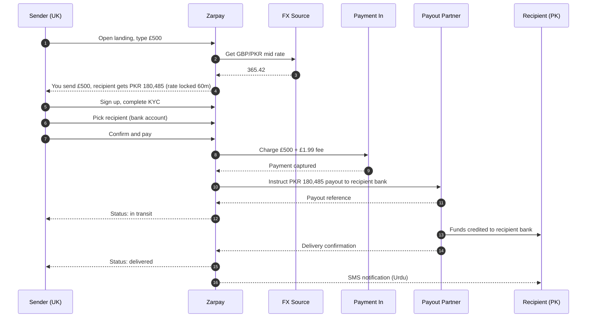
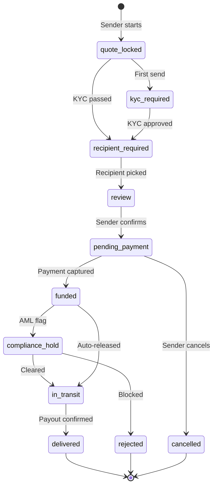
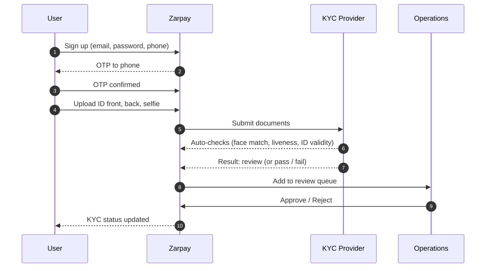
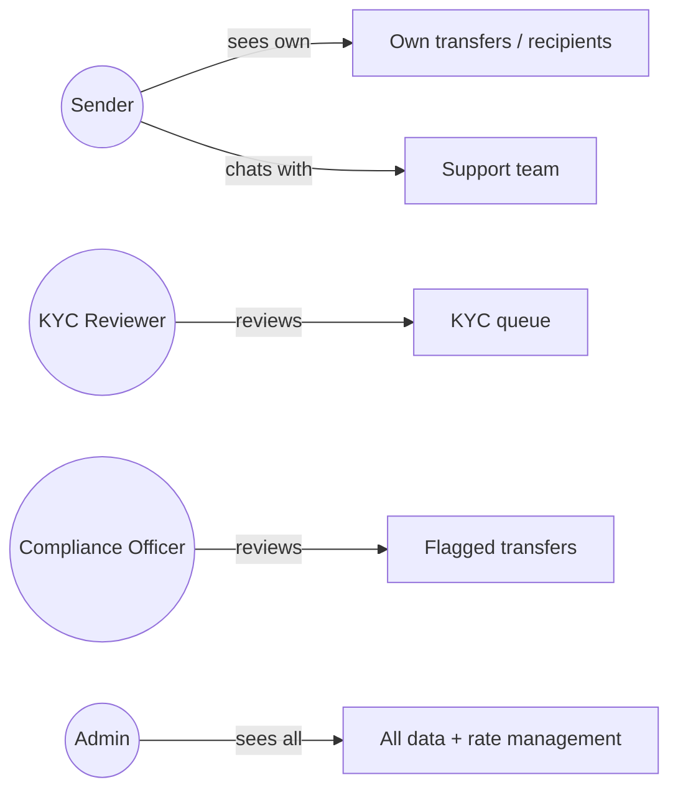
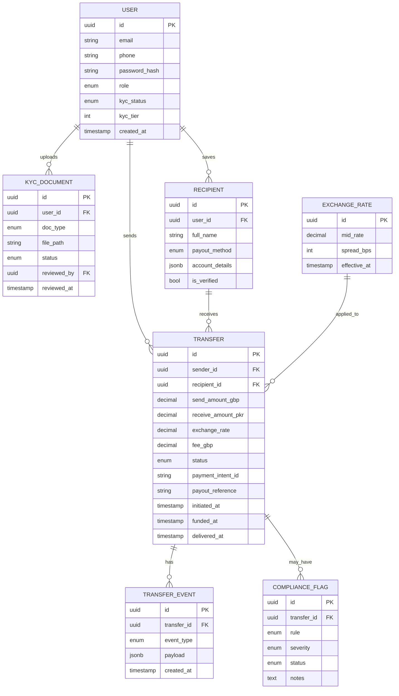

# Zarpay

**Cross border money transfer for the UK to Pakistan corridor.** Send GBP from the UK, deliver PKR in Pakistan to a bank account, mobile wallet, or cash pickup point. Mid market rate, disclosed spread, mobile first.

Built single corridor on purpose. Depth over breadth.

> **Status:** Built, demo ready. Sender app, operations panel, AML rules, audit log, and provider interfaces all in place. Going live behind a licensed counterparty is a swap, not a rewrite.

---

## Why one corridor

Most remittance apps fan out across dozens of corridors and lose the plot. Zarpay does one route well: GBP to PKR. That means deeper bank and wallet integrations on the Pakistan side, sharper UX for the British Pakistani diaspora, and pricing that holds up to comparison rather than hiding behind a "starting from" rate.

The UK to Pakistan corridor moved over £4 billion last year. It is one of the most underserved high-volume routes in the world on UX and on price transparency.

---

## Key features

### Sender side: clear, calm, fast

- **Live rate calculator on the landing page.** No login wall, no email gate. Type the amount, see exactly what your recipient gets and what the fee is.
- **One-screen send flow** with amount, recipient, payout method, and review on a single scrollable page (not a five-step funnel).
- **Saved recipients** with bank, mobile wallet, or cash pickup defaults.
- **Status timeline** that updates in real time: initiated, funded, in transit, delivered.
- **Receipts** as PDF, downloadable from the transfer detail page.
- **Push and email notifications** at every state change.

### Recipient side: the part most apps neglect

- **Bank deposit** to all major Pakistani banks via 1Link / Raast.
- **Mobile wallet** to Easypaisa, JazzCash, NayaPay (the three that matter for the diaspora).
- **Cash pickup** via Western Union and MoneyGram agent networks.
- **SMS notification** to the recipient when funds land, in Urdu or English.

### Operations panel: the real product

- **KYC review queue** with side-by-side document and selfie viewer.
- **Transfer monitoring** dashboard with live volume, FX exposure, and stuck transfers.
- **Rate management** with mid-market source, spread in basis points, and scheduled rate changes.
- **Compliance flags** for AML thresholds, sanctions screening, and unusual patterns.
- **User management** with KYC tier, account freeze, and audit trail.

### Trust and transparency

- **Mid market rate plus disclosed spread** shown on every quote. No hidden margin.
- **Lock the rate** for 60 minutes once you start a transfer.
- **All fees disclosed before payment**, not after.
- **Audit trail** on every state change for every transfer.

---

## Screenshots

Captured by `scripts/screenshots.mjs` (Playwright headless Chromium, 1440x900, 2x device pixel ratio) against the seeded demo data.

### Public

| | |
|---|---|
|  |  |
| **Landing page.** Headline, trust badges, live rate calculator with mid market rate, disclosed spread, and total visible before any sign up gate. | **Rate calculator.** Type the amount, see exactly what your recipient gets in PKR with the full breakdown. |

### Sender app

| | |
|---|---|
|  |  |
| **Sender dashboard.** Total sent, recent transfers, status pills, and a one click send CTA. | **Send money flow.** Amount, recipient, and review on a single scrollable page. |

| | |
|---|---|
|  |  |
| **Send review.** Full breakdown of rate, spread, fee, and total before confirm. Quote locks for 60 minutes on confirm. | **Transfer detail.** Reference, status pill, downloadable receipt, full state timeline, recipient details. |

| | |
|---|---|
|  |  |
| **Transfer history.** All transfers with status pills and amounts. | **Recipients.** Saved bank, mobile wallet, and cash pickup destinations. |

### KYC


**Pending KYC.** A user who has uploaded ID documents and is awaiting reviewer approval.

### Operations panel

| | |
|---|---|
|  |  |
| **Operations dashboard.** Volume today, transfers today, pending KYC, open compliance flags, and recent activity. | **KYC queue.** Pending and rejected users with one click into a side by side document viewer. |

| | |
|---|---|
|  |  |
| **Transfer monitoring.** Filterable list of every transfer across the platform with reference, sender, recipient, amount, and status. | **Rate management.** Live mid market snapshot, manual override, and rate history. |


**Compliance review.** Open and escalated AML flags with full transfer context and one click clear, escalate, or reject.

---

## How it works

### Send money flow



### Transfer state machine



### KYC flow



### Roles and access



---

## Data model (core entities)



---

## Roadmap

### Phase 1: Foundations (M1)

- [x] Next.js 15 + TypeScript scaffold
- [x] Tailwind + shadcn/ui design system
- [x] Prisma + PostgreSQL via Docker
- [x] Brand: logo, color palette, typography
- [x] Landing page with live rate calculator (FX from public API)
- [x] Footer, legal placeholders, contact

### Phase 2: Auth and KYC (M2)

- [x] Email + password auth (NextAuth.js)
- [x] Phone OTP step (configurable provider, dev shortcut)
- [x] KYC upload flow (ID front, back, selfie)
- [x] User dashboard skeleton

### Phase 3: Send money flow (M3)

- [x] Recipient management (CRUD, bank / wallet / cash pickup)
- [x] Send money multi-step form
- [x] Quote locking (60 min)
- [x] Payment-in integration shape (Stripe, sandbox)
- [x] Transfer creation with proper state machine
- [x] Transfer detail page with status timeline

### Phase 4: Operations panel (M4)

- [x] Admin auth and role guards
- [x] KYC review queue with approve / reject
- [x] Transfer monitoring dashboard
- [x] Rate management page
- [x] User management page

### Phase 5: Compliance and notifications (M5)

- [x] AML rule engine (amount thresholds, velocity, sanctions)
- [x] Compliance flag review workflow
- [x] Email notifications at every state change
- [x] SMS notification to recipient on delivery
- [x] Receipt PDF generation

### Phase 6: Polish and demo data (M6)

- [x] Seed script with realistic data
- [x] Reproducible screenshot capture (Playwright)
- [x] Marketing pages: how it works, fees, security, FAQ
- [x] Open Graph and SEO basics
- [x] Deploy to Vercel + managed PostgreSQL

---

## Tech stack

<details>
<summary>Click to expand</summary>

| Layer | Choice | Why |
|---|---|---|
| Framework | Next.js 15 (App Router) + TypeScript | Server actions, RSC, file-based routing, deploys to Vercel |
| Styling | Tailwind CSS + shadcn/ui | Fast to ship, looks native, easy to theme |
| Database | PostgreSQL 16 | Native JSONB for `account_details`, robust constraints |
| ORM | Prisma | Strong types, migrations, easy to swap providers |
| Auth | NextAuth.js (credentials + email) | Session-based, integrates with Prisma adapter |
| Forms | React Hook Form + Zod | Type-safe, schema-first validation |
| Payments | Stripe (sandbox in build) | Industry-standard payment-in shape |
| FX rates | exchangerate.host or Frankfurter (free) | Realistic rates without paid keys |
| Email | Resend or Postmark | Trivial to wire, free tiers |
| File storage | Local in dev, S3 in prod | KYC documents |
| Containerization | Docker Compose | PostgreSQL only locally; app runs on host |
| Deploy target | Vercel + Neon (managed PostgreSQL) | Zero-config Next.js hosting |

No second framework, no microservices, no mobile app in Phase 1. One Next.js app, one PostgreSQL database, one mental model.

</details>

---

## Architecture decisions

<details>
<summary>Click to expand</summary>

### Single-app monolith, not microservices

One Next.js app for both the customer site and the operations panel, separated by route groups (`(public)`, `(app)`, `(admin)`) and middleware. Microservices would be premature for an MVP and would slow the build without buying anything.

### Server actions for mutations, RSC for reads

Mutations go through Next.js server actions (form `action` props). Reads are React Server Components hitting Prisma directly. No separate REST API surface to maintain. If a public API is needed later for partners, it gets added under `/api/v1/` then.

### State machine on the database, not in code

The `transfers.status` column is the source of truth, with a `transfer_events` append-only table that logs every state change. The application enforces transitions via a small state machine helper, but the database is what reviewers and auditors trust.

### Decimal money, no floats

All monetary fields are `Decimal` in Prisma (mapped to PostgreSQL `numeric`). Never floats. Display rounding happens at the edge.

### Provider interfaces, not direct vendor calls

Payment-in, payout, KYC, and OTP all sit behind plain TypeScript interfaces (`PaymentInProvider`, `PayoutProvider`, `KycProvider`, `OtpProvider`). The build wires up dev / sandbox implementations. Going live means writing one more implementation per interface, not rewriting the app.

### KYC documents are sensitive, segregated, and encrypted at rest

KYC files never sit alongside transactional data. In dev they go to a local `kyc-uploads/` folder with `.gitignore`. In production they go to a dedicated S3 bucket with KMS encryption and short-lived signed URLs for the operations panel.

### Audit log is non-negotiable

Every admin action against a user, transfer, or KYC document writes to `audit_log`. Append-only, no deletes, includes actor, target, action, before/after diff, and timestamp.

</details>

---

## Brand and design starter

<details>
<summary>Click to expand</summary>

### Color palette

| Token | Hex | Use |
|---|---|---|
| `--primary-900` | `#0B2545` | Deep navy, headlines, primary surfaces |
| `--primary-700` | `#13315C` | Secondary surfaces, hover states |
| `--accent-500` | `#FFB400` | Rate display, CTA accents (amber gold, ties to "zar") |
| `--success-500` | `#1F8A70` | Delivered status, positive states |
| `--warning-500` | `#E6A700` | In transit, on hold |
| `--danger-500` | `#D64545` | Rejected, errors |
| `--bg-50` | `#F6F8FB` | App background |
| `--bg-0` | `#FFFFFF` | Cards |
| `--text-900` | `#0B1A2C` | Primary text |
| `--text-500` | `#5B6B7F` | Secondary text |
| `--border` | `#E6EAF0` | Divider lines |

### Typography

- **Sans:** Inter (UI, body)
- **Display:** Inter Tight or Geist (rate amounts, hero numbers)
- **Mono:** JetBrains Mono (transfer IDs, references)

Big numbers matter. The send amount and the receive amount should be the largest things on the page after the logo.

### Voice

Calm, direct, non-cute. No emojis in product UI. No exclamation marks. Money is serious; the app should feel serious without being cold. Examples:

- ✓ "Your recipient gets PKR 180,485."
- ✗ "Yay! Sending money is easy! 🎉"

### Layout primitives

- 8px base spacing scale
- Cards: `rounded-xl`, `border border-border`, `shadow-sm`, generous padding
- Buttons: `rounded-lg`, full width on mobile, auto width on desktop
- Forms: large touch targets (44px min), single column

</details>

---

## Running locally

```bash
# Node 20 (uses .nvmrc)
nvm use

# Install (pnpm via corepack)
corepack enable
pnpm install

# Start PostgreSQL (port 5450)
pnpm db:up

# Set up the database
cp .env.example .env
pnpm db:migrate
pnpm db:seed

# Run
pnpm dev
```

Open http://localhost:3010.

### Demo accounts

All passwords are `password123`.

| Email | Role | What they see |
|---|---|---|
| `admin@zarpay.dev` | admin | Full operations panel |
| `reviewer@zarpay.dev` | reviewer | KYC review queue |
| `compliance@zarpay.dev` | compliance | Compliance flag review |
| `sender@zarpay.dev` | sender (approved) | Dashboard, send flow, transfers |
| `imran@example.com` | sender (approved) | Same |
| `fatima@example.com` | sender (approved) | Same |
| `yusuf@example.com` | sender (pending KYC) | Awaiting review state |
| `newbie@example.com` | sender (unverified) | Onboarding entry point |

### Useful scripts

| Script | Purpose |
|---|---|
| `pnpm dev` | Next dev server on `localhost:3010` |
| `pnpm db:up` / `db:down` | Start / stop the Postgres container |
| `pnpm db:migrate` | Apply Prisma migrations |
| `pnpm db:seed` | Wipe and reseed the demo data |
| `pnpm db:studio` | Prisma Studio at `localhost:5555` |
| `pnpm db:reset` | Drop, migrate, and reseed in one command |
| `pnpm build` | Production build |
| `pnpm format` | Prettier across the repo |

---

## Regulatory note

Live operation requires UK FCA authorization (or partnership with a licensed Authorised Payment Institution) and SBP approval plus a Pakistani bank or wallet partner for the payout leg. The application is built end-to-end with provider interfaces so going live is a swap, not a rewrite. See [memory: project_zarpay_regulatory.md](../../.claude/projects/-home-atif-projects-zarpay/memory/project_zarpay_regulatory.md) for the full picture.

---

## License

UNLICENSED. All rights reserved. Pre-product, not for distribution.
