# Zarpay

**Cross border money transfer for the UK to Pakistan corridor.** Send GBP from the UK, deliver PKR in Pakistan to a bank account, mobile wallet, or cash pickup point. Mid market rate, disclosed spread, mobile first.

Built single corridor on purpose. Depth over breadth.

> **Status:** Built, demo ready. Sender app, operations panel, AML rules, audit log, and provider interfaces all in place. Going live behind a licensed counterparty is a swap, not a rewrite.

---

## Why one corridor

Most remittance apps fan out across dozens of corridors and lose the plot. Zarpay does one route well: GBP to PKR. That means deeper bank and wallet integrations on the Pakistan side, sharper UX for the British Pakistani diaspora, and pricing that holds up to comparison rather than hiding behind a "starting from" rate.

The UK to Pakistan corridor moved over £4 billion last year. It is one of the most underserved high-volume routes in the world on UX and on price transparency.

---

## Key features

### Sender side: clear, calm, fast

- **Live rate calculator on the landing page.** No login wall, no email gate. Type the amount, see exactly what your recipient gets and what the fee is.
- **One-screen send flow** with amount, recipient, payout method, and review on a single scrollable page (not a five-step funnel).
- **Saved recipients** with bank, mobile wallet, or cash pickup defaults.
- **Status timeline** that updates in real time: initiated, funded, in transit, delivered.
- **Receipts** as PDF, downloadable from the transfer detail page.
- **Push and email notifications** at every state change.

### Recipient side: the part most apps neglect

- **Bank deposit** to all major Pakistani banks via 1Link / Raast.
- **Mobile wallet** to Easypaisa, JazzCash, NayaPay (the three that matter for the diaspora).
- **Cash pickup** via Western Union and MoneyGram agent networks.
- **SMS notification** to the recipient when funds land, in Urdu or English.

### Operations panel: the real product

- **KYC review queue** with side-by-side document and selfie viewer.
- **Transfer monitoring** dashboard with live volume, FX exposure, and stuck transfers.
- **Rate management** with mid-market source, spread in basis points, and scheduled rate changes.
- **Compliance flags** for AML thresholds, sanctions screening, and unusual patterns.
- **User management** with KYC tier, account freeze, and audit trail.

### Trust and transparency

- **Mid market rate plus disclosed spread** shown on every quote. No hidden margin.
- **Lock the rate** for 60 minutes once you start a transfer.
- **All fees disclosed before payment**, not after.
- **Audit trail** on every state change for every transfer.

---

## Screenshots

Captured by `scripts/screenshots.mjs` (Playwright headless Chromium, 1440x900, 2x device pixel ratio) against the seeded demo data.

### Public

| | |
|---|---|
| 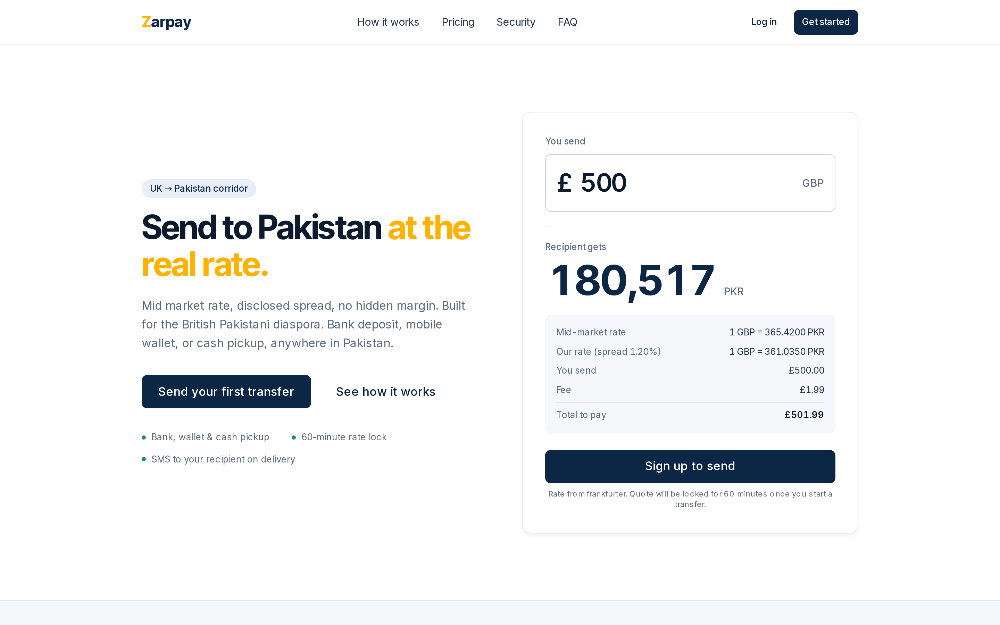 | 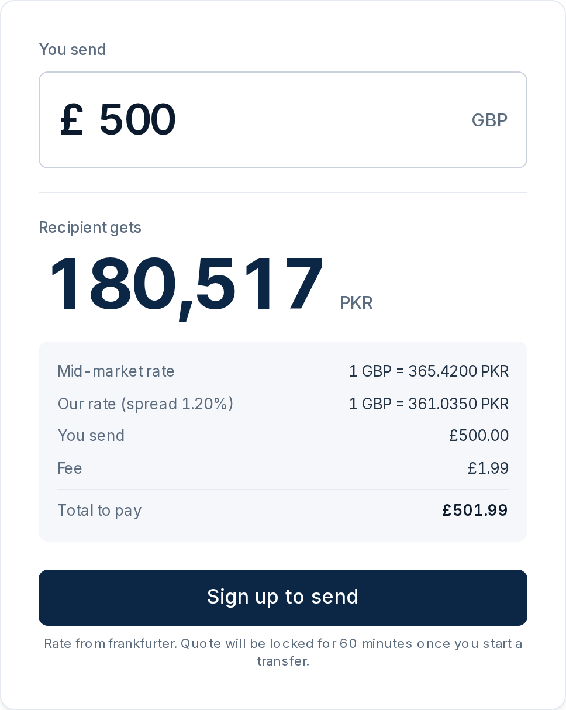 |
| **Landing page.** Headline, trust badges, live rate calculator with mid market rate, disclosed spread, and total visible before any sign up gate. | **Rate calculator.** Type the amount, see exactly what your recipient gets in PKR with the full breakdown. |

### Sender app

| | |
|---|---|
| 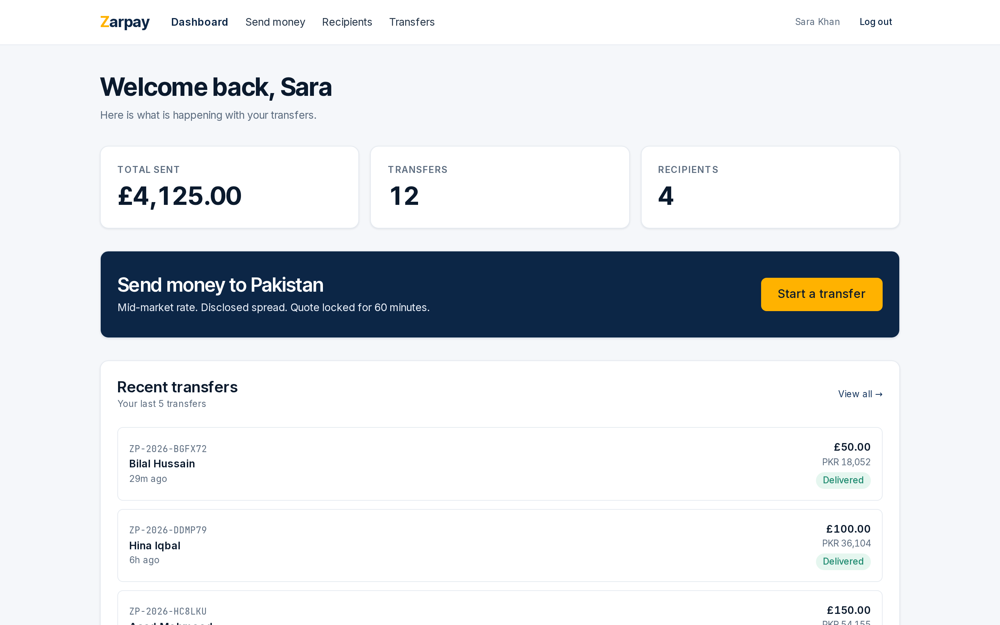 | 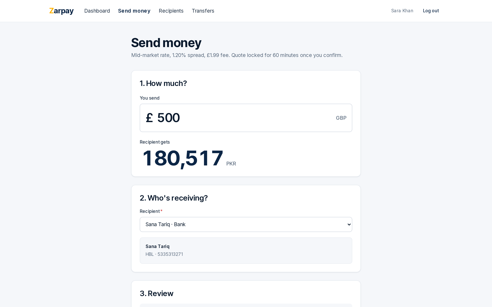 |
| **Sender dashboard.** Total sent, recent transfers, status pills, and a one click send CTA. | **Send money flow.** Amount, recipient, and review on a single scrollable page. |

| | |
|---|---|
| 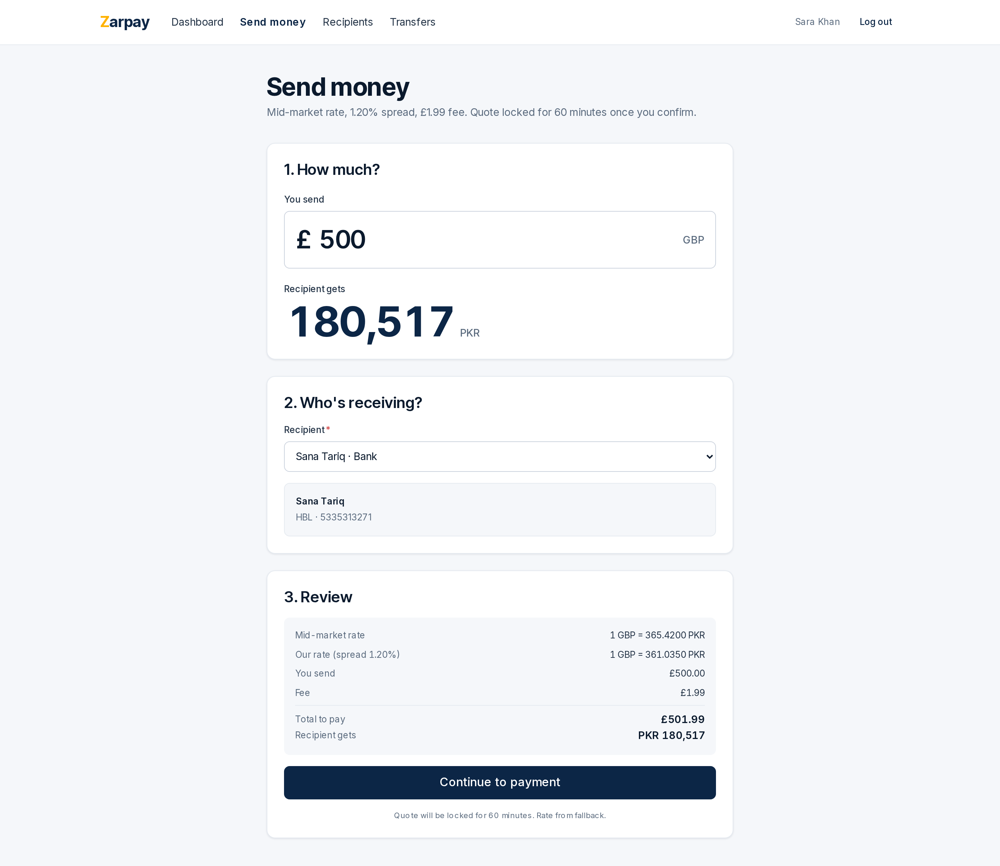 | 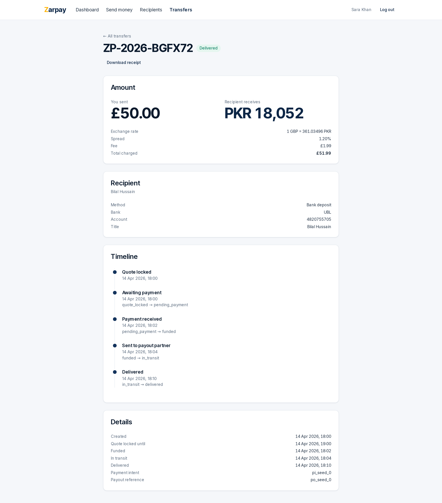 |
| **Send review.** Full breakdown of rate, spread, fee, and total before confirm. Quote locks for 60 minutes on confirm. | **Transfer detail.** Reference, status pill, downloadable receipt, full state timeline, recipient details. |

| | |
|---|---|
| 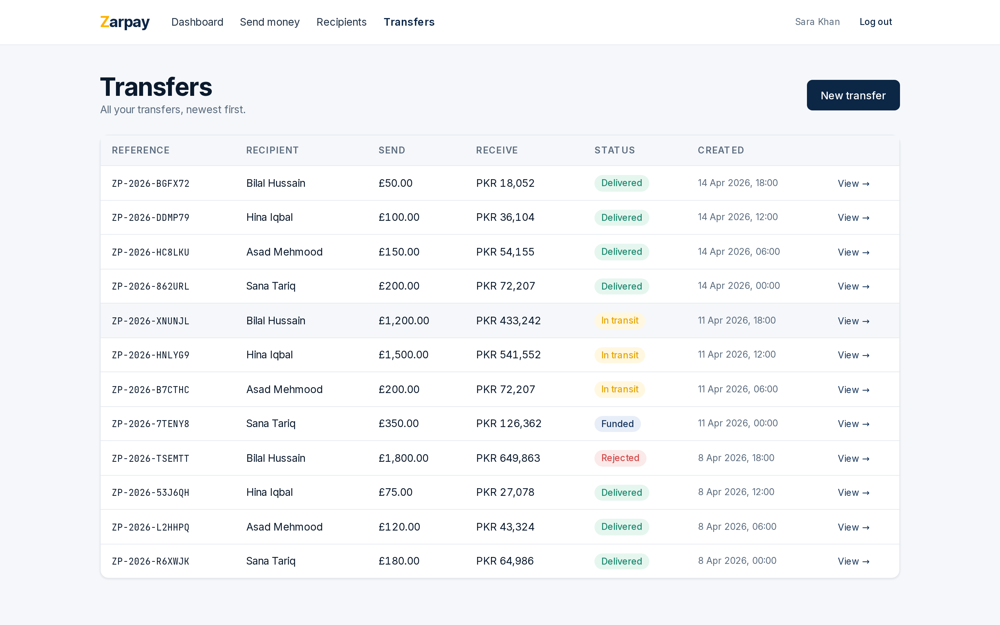 | 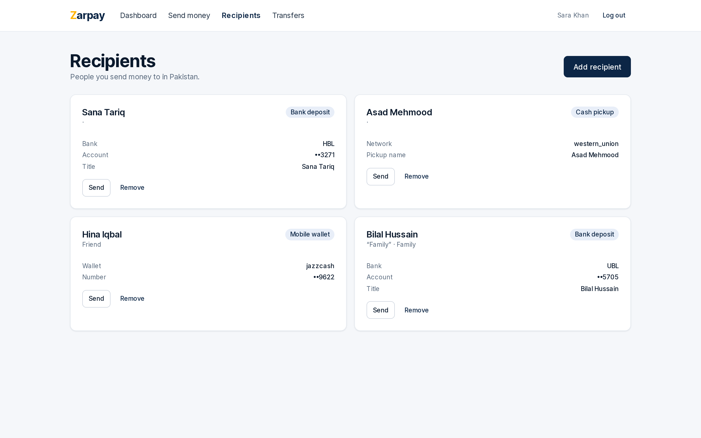 |
| **Transfer history.** All transfers with status pills and amounts. | **Recipients.** Saved bank, mobile wallet, and cash pickup destinations. |

### KYC

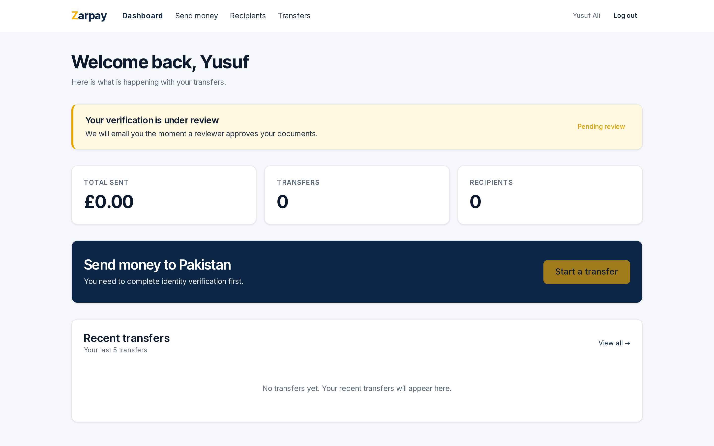

**Pending KYC.** A user who has uploaded ID documents and is awaiting reviewer approval.

### Operations panel

| | |
|---|---|
| 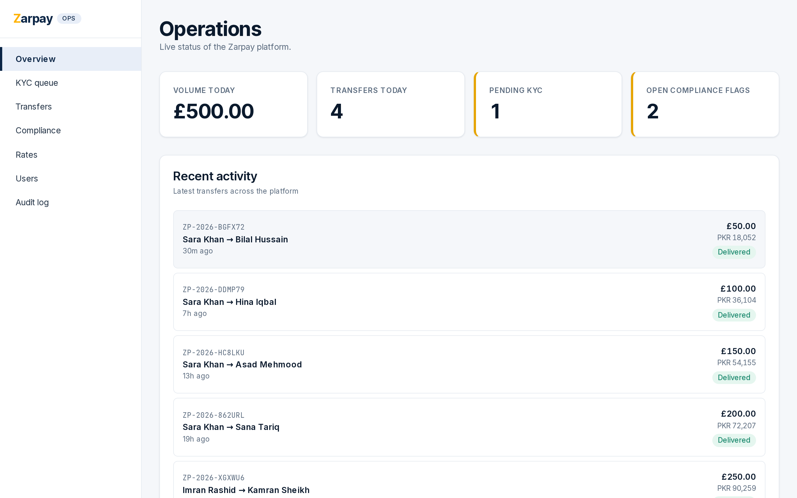 | 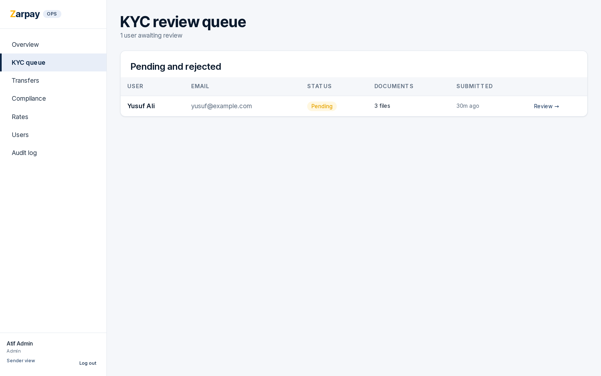 |
| **Operations dashboard.** Volume today, transfers today, pending KYC, open compliance flags, and recent activity. | **KYC queue.** Pending and rejected users with one click into a side by side document viewer. |

| | |
|---|---|
| 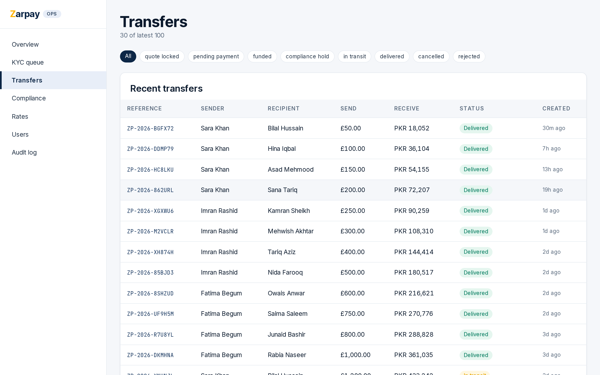 | 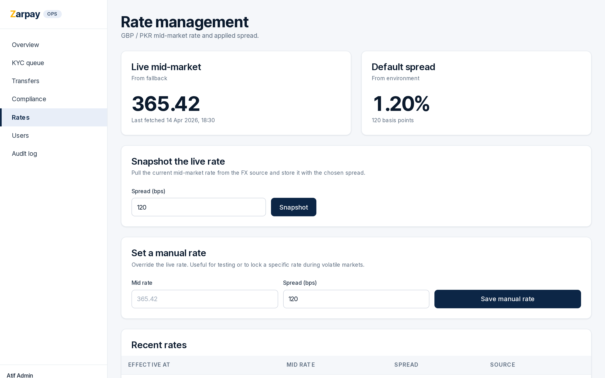 |
| **Transfer monitoring.** Filterable list of every transfer across the platform with reference, sender, recipient, amount, and status. | **Rate management.** Live mid market snapshot, manual override, and rate history. |

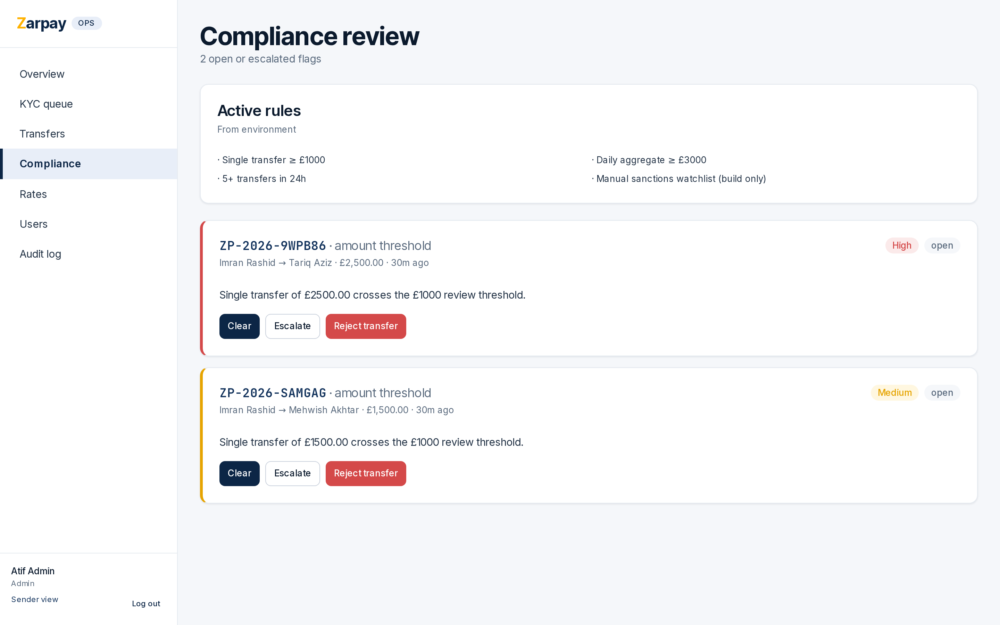

**Compliance review.** Open and escalated AML flags with full transfer context and one click clear, escalate, or reject.

---

## Regulatory note

Live operation requires UK FCA authorization (or partnership with a licensed Authorised Payment Institution) and SBP approval plus a Pakistani bank or wallet partner for the payout leg. The application is built end-to-end with provider interfaces so going live is a swap, not a rewrite. See [memory: project_zarpay_regulatory.md](../../.claude/projects/-home-atif-projects-zarpay/memory/project_zarpay_regulatory.md) for the full picture.

---

## License

UNLICENSED. All rights reserved. Pre-product, not for distribution.
